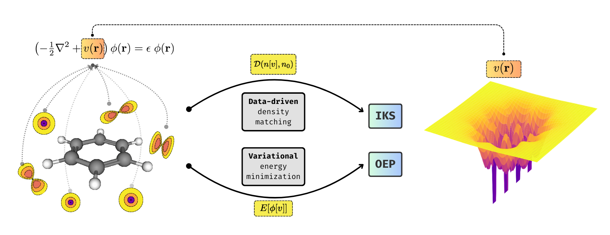

# <h1 align='center'>Multipole Splats</h1>

`multipole-splats` is a research library for inverse Kohn--Sham (IKS) and optimized effective potential (OEP) calculations. It represents a local potential by finite-width Gaussian monopoles and dipoles, projects that potential into a molecular atomic-orbital basis, and differentiates the resulting eigensystem and energy with JAX. PySCF provides molecular integrals, quadrature, and LibXC functionals.

* Code author: **Matija Medvidović** (ETH Zürich)
* Preprint: **[TBA]**

This is research code. The API and numerical methods may evolve as the research develops, and there is no guarantee of permanent maintenance or backward compatibility. The code has been written manually and verified by AI. The documentation has been AI-generated and may contain errors. Please raise an issue if you encounter problems.



## ...Splats?

**[PLACEHOLDER]**

## Code example

The following closed-shell water calculation minimizes the exact-exchange energy over local
potentials. Install the package in a Python 3.10-or-newer environment first. Optax is an
example-only optimizer and is therefore installed separately:

```bash
python -m pip install .
python -m pip install optax
```

Enable JAX double precision before constructing any arrays, then build a small PySCF reference
calculation. PySCF converts the input geometry to Bohr internally.

```python
import jax

jax.config.update("jax_enable_x64", True)

import jax.numpy as jnp
from pyscf import gto, scf

mol = gto.M(
    atom="""
        O  0.000  0.000  0.000
        H  0.000 -0.757  0.587
        H  0.000  0.757  0.587
    """,
    basis="cc-pVTZ",
)

mf = scf.RHF(mol).run()
dm_ref = jnp.asarray(mf.make_rdm1())
```

Assemble the AO data, quadrature, exact-exchange energy, and OEP loss. The reference density fixes
the FA background and electron count; it is not the density being optimized.

```python
from msplats import AtomicOrbitals, EnergyFunctional, EnergyLoss, Integrals
from msplats.grid import Grid
from msplats.xc import ExactExchange

ao = AtomicOrbitals(mol)
ints = Integrals(mol)
grid = Grid.from_pyscf(mol, level=3)

energy = EnergyFunctional(ints, ExactExchange(ints.cderi))
loss = EnergyLoss(ao, energy, grid, dm_ref)
```

Initialize the variational correction. Exact exchange has $\gamma=1$, so the constrained excess
monopole charge is zero. `MultipolePotential` contains only $v_{\mathrm{MS}}$; `EnergyLoss` adds the
fixed nuclear and FA terms when it constructs the one-electron problem.

```python
from msplats import MultipolePotential
from msplats.potential.multipole import BoysInitializer

atom_coords = jnp.asarray(mol.atom_coords())
atom_charges = jnp.asarray(mol.atom_charges())
initializer = BoysInitializer(mf)

potential = MultipolePotential(
    num_monopoles=32,
    num_dipoles=128,
    atom_coords=atom_coords,
    atom_charges=atom_charges,
    geometry_init=initializer,
    excess_charge=0.0,
    key=jax.random.key(0),
)
```

Finally, follow the manuscript's use of Adamax with a compact 500-step, fixed-learning-rate example.
Equinox differentiates the array leaves of the potential and leaves its static data untouched.

```python
import equinox as eqx
import optax

optimizer = optax.adamax(learning_rate=5e-4)
opt_state = optimizer.init(eqx.filter(potential, eqx.is_inexact_array))


@eqx.filter_jit
def step(potential, opt_state):
    value, grads = eqx.filter_value_and_grad(loss)(potential)
    updates, opt_state = optimizer.update(grads, opt_state, potential)
    potential = eqx.apply_updates(potential, updates)
    return potential, opt_state, value


for step in range(500):
    potential, opt_state, value = step(potential, opt_state)

    if (step + 1) % 10 == 0:
        print(f"step {step + 1:3d}: {value:.10f} Ha")
```

The resulting `potential` is a callable JAX/Equinox module for the variational local multipole correction and can be evaluated or differentiated at real-space coordinates in Bohr. Adamax is only one possible optimization strategy: the library supplies the scalar objective and its gradients, so other JAX-compatible optimizers can be used without changing the nature of the electronic-structure calculation.

## Physics corner

The central objective of this code is to compute local effective electronic potentials through direct optimization. Given any orbital-dependent objective, we define the orbitals $\phi = \phi[v]$ as functionals of the potential $v$ implicitly through

$$
\left( -\tfrac12 \nabla ^2 + v (\mathrm r) \right) \phi (\mathrm r)  = \epsilon \phi (\mathrm r)
$$

The potential is directly parametrized and optimized. The local trial potential is separated into fixed nuclear and Fermi--Amaldi (FA) backgrounds and a trainable multipole-splat correction:

$$
v_\theta(\mathbf r) = v_\mathrm{ext}(\mathbf r) + v_\mathrm{FA}(\mathbf r) + v_\mathrm{MS}(\mathbf r), \qquad v_\mathrm{FA}(\mathbf r) = \frac{N-1}{N} \int \mathrm{d}^3 \mathbf r' \, \frac{n_\mathrm{ref}(\mathbf r')}{|\mathbf r - \mathbf r'|} \, .
$$

The multipole splat correction $v_\mathrm{FA}$ is modeled as a Coulomb potential of a cloud of Gaussian monopoles and dipoles. Each splat is an analytic parametrized function.

$$
v_\mathrm{MS}(\mathbf r) = \sum_{k=1}^{N_1} q_k v_k(\mathbf r) - \sum_{k=1}^{N_2} \mathbf p_k \cdot \nabla v_k(\mathbf r), \qquad v_k(\mathbf r) = \frac{\textrm{erf} \left( \sqrt{\alpha_k} |\mathbf r - \mathbf a_k| \right)}{|\mathbf r - \mathbf a_k|} \, .
$$

with optimizable parameters $\{q_k, \mathbf{p}_k, \alpha_k, \mathbf{a}_k\}$. Monopole charges are constrained algebraically as $\sum_{k=1}^{N_1} q_k = 1 - \gamma$ so a neutral calculation with exact-exchange fraction $\gamma$ has the correct asymptotic decay for every parameter value. The *optimized effective potential* formalism minimizes an arbitrary orbital-dependent variational energy functional $E[\phi]$ over densities generated by a local potential,

$$
v_\mathrm{OEP} = \underset{v}{\textrm{arg\,min}} \, E[\phi[v]] \; ,
$$

while the *inverse Kohn--Sham* (IKS) formalism matches the potential against a target *external* density $n_0$ by minimizing density divergence $\mathcal{D}$,

$$
v_\mathrm{IKS} = \underset{v}{\textrm{arg\,min}} \, \mathcal{D} (n[v], n_0) \; .
$$

In either case, we do not require the Kohn--Sham response inversion. The optimization is stable and convergent.